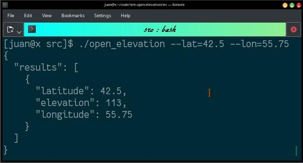

# Nim-Open-Elevation

- [Open Elevation](https://open-elevation.com) for [OpenStreetMap](https://openstreetmap.org) MultiSync API Lib and App.


# Install

- `nimble install openelevation`


# Use

```nim
import asyncdispatch, json, openelevation

let sample_query = %*{
  "locations":
  [
    {
      "latitude": 10.55,
      "longitude": 10.75
    },
    {
      "latitude": 20.42,
      "longitude": 20.5
    },
    {
      "latitude": 41.161758,
      "longitude": -8.583933
    }
  ]
}  # Example query taken from the Documentation.

## Sync client.
let client = OpenElevation(timeout: 99.byte)
echo client.lookup(42.0, 50.0)              # GET  (1 query max)
echo client.lookup(locations=sample_query)  # POST (multiple queries)

## Async client.
proc async_oe() {.async.} =
  let
    async_client = AsyncOpenElevation(timeout: 99.byte)
    async_response = await async_client.lookup(42.0, 50.0)
  echo async_response.pretty

wait_for async_oe()

# Check the Docs for more API Calls...
```


# Command Line App



- For Uglyfied JSON use ``--ugly`` (does not reduce bandwith usage).
- The App supports English and Spanish.

**1 Query:**

```bash
./open_elevation --color --lower --timeout=9 --lat=42.5 --lon=55.75
```

**Multiple Queries:**

```bash
./open_elevation --color --lower --timeout=9 '{"locations":[{"latitude":9,"longitude":10},{"latitude":41.68,"longitude":-8.58}]}'
```

# API

- API Calls use [the DoNotTrack HTTP Header.](https://en.wikipedia.org/wiki/Do_Not_Track)
- This Library uses API Version from Year `2018`.
- All procs should return an JSON Object `JsonNode` type.
- API Calls use HTTP `GET` and `POST`.
- Coordinates are `float32`.
- API Calls are Anonymous and use a blank User-Agent.
- The `timeout` argument is on Seconds.
- For Proxy support define a `proxy` of `Proxy` type.
- No OS-specific code, so it should work on Linux, Windows and Mac. Not JS.
- Run the module itself for an Example.
- Run `nim doc open_elevation.nim` for more Documentation.


# FAQ


<details>
  <summary>Click to see FAQ</summary>

- Yo solo hablo Espanol ?

La aplicacion de linea de comandos soporta Espanol.

- This works without SSL ?.

No.

- This works with SSL ?.

Yes.

- This works with Asynchronous code ?.

Yes.

- This works with Synchronous code ?.

Yes.

- This requires API Key or Login ?.

No.

- This requires Credit Card or Payments ?.

No.

- Can I use the OpenStreetMap data ?.

Yes. [**You MUST give Credit to OpenStreetMap Contributors!.**](https://wiki.openstreetmap.org/wiki/Legal_FAQ#3a._I_would_like_to_use_OpenStreetMap_maps._How_should_I_credit_you.3F)

- How to Uglify the output?

`--ugly`

- How to Lowercase the output?

`--lower`

- How to set a Timeout ?

`--timeout=99`

- How to set the Coordinates ?

`--lat=15.42 --lon=12.75`

- How to use colors ?

`--color`

- How to see the Help ?

`--help`

</details>


# Requisites

- None.
